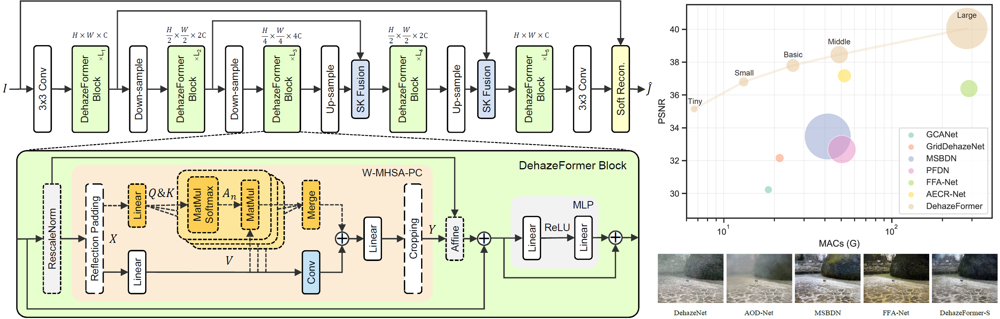

# Vision Transformers for Single Image Dehazing

## Abstract
Image dehazing is a crucial low-level vision task that involves estimating latent haze-free images from hazy images. While convolutional neural network-based methods have dominated this field, vision Transformers, which have excelled in high-level vision tasks, have not been extensively explored for image dehazing. This project introduces DehazeFormer, an innovative model based on the popular Swin Transformer, but with key modifications such as a revised normalization layer, activation function, and spatial information aggregation scheme, tailored for image dehazing.

We trained multiple variants of DehazeFormer on various datasets to validate its effectiveness. On the commonly used SOTS indoor set, our small model surpasses FFA-Net with only 25% of the parameters and 5% of the computational cost. Notably, our large model is the first to achieve a PSNR over 40 dB on the SOTS indoor set, significantly outperforming previous state-of-the-art methods. Additionally, we have collected a large-scale realistic remote sensing dehazing dataset to evaluate the model's capability to remove highly non-homogeneous haze.



## News
- **Mar 06, 2023:** Hugging Face [demo](https://huggingface.co/spaces/IDKiro/DehazeFormer_Demo) is updated. It features an [MCT](https://github.com/IDKiro/MCT) variant trained with a mixed dataset.
- **Feb 25, 2023:** Paper accepted by IEEE TIP. The [final version](https://doi.org/10.1109/TIP.2023.3256763) includes additional experiments.
- **Sep 23, 2022:** Released [gUNet](https://github.com/IDKiro/gUNet) with improved training code.
- **Apr 11, 2022:** [Arxiv paper link](https://arxiv.org/abs/2204.03883) and [BaiduPan link](https://pan.baidu.com/s/1WVdNccqDMnJ5k5Q__Y2dsg?pwd=gtuw) are updated.
- **Apr 07, 2022:** Beta version released, including codes, [pre-trained models](https://drive.google.com/drive/folders/1gnQiI_7Dvy-ZdQUVYXt7pW0EFQkpK39B?usp=sharing), and [RS-Haze-RGB](https://drive.google.com/drive/folders/1oaQSpdYHxEv-nMOB7yCLKfw2NDCJVtrx?usp=sharing).

## Preparation

### Installation
Tested on PyTorch 1.10.2 with CUDA 11.3 and cuDNN 8.2.0.

1. Create a new conda environment:
    ```sh
    conda create -n pt1102 python=3.7
    conda activate pt1102
    ```

2. Install dependencies:
    ```sh
    conda install pytorch=1.10.2 torchvision torchaudio cudatoolkit=11.3 -c pytorch
    pip install -r requirements.txt
    ```

### Download
Pretrained models and datasets are available on [GoogleDrive](https://drive.google.com/drive/folders/1Yy_GH6_bydYPU6_JJzFQwig4LTh86VI4?usp=sharing) or [BaiduPan](https://pan.baidu.com/s/1WVdNccqDMnJ5k5Q__Y2dsg?pwd=gtuw) (gtuw).

The final directory structure should be as follows:
```
┬─ save_models
│   ├─ indoor
│   │   ├─ dehazeformer-b.pth
│   │   └─ ... (other models)
│   └─ ... (other experiments)
└─ data
    ├─ RESIDE-IN
    │   ├─ train
    │   │   ├─ GT
    │   │   │   └─ ... (image files)
    │   │   └─ hazy
    │   │       └─ ... (corresponding hazy images)
    │   └─ test
    │       └─ ...
    └─ ... (other datasets)
```

## Training and Evaluation

### Training
Modify the training settings in the `configs` folder. Then, run the following script to train the model:
```sh
python train.py --model (model name) --dataset (dataset name) --exp (exp name)
```
For example, to train DehazeFormer-B on the ITS dataset:
```sh
python train.py --model dehazeformer-b --dataset RESIDE-IN --exp indoor
```
[TensorBoard](https://pytorch.org/docs/1.10/tensorboard.html) will record the loss and evaluation performance during training.

### Testing
Run the following script to test the trained model:
```sh
python test.py --model (model name) --dataset (dataset name) --exp (exp name)
```
For example, to test DehazeFormer-B on the SOTS indoor set:
```sh
python test.py --model dehazeformer-b --dataset RESIDE-IN --exp indoor
```
Main test scripts can be found in `run.sh`.# image-dehazing-using-visual-transformers-
